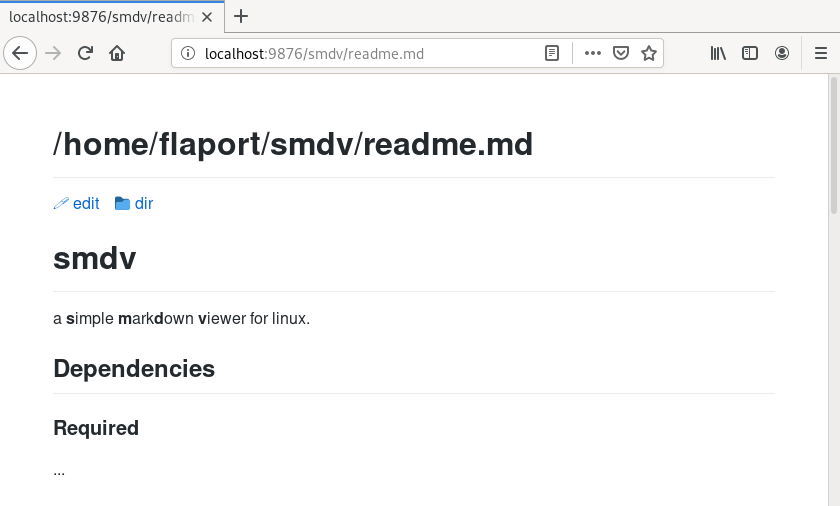
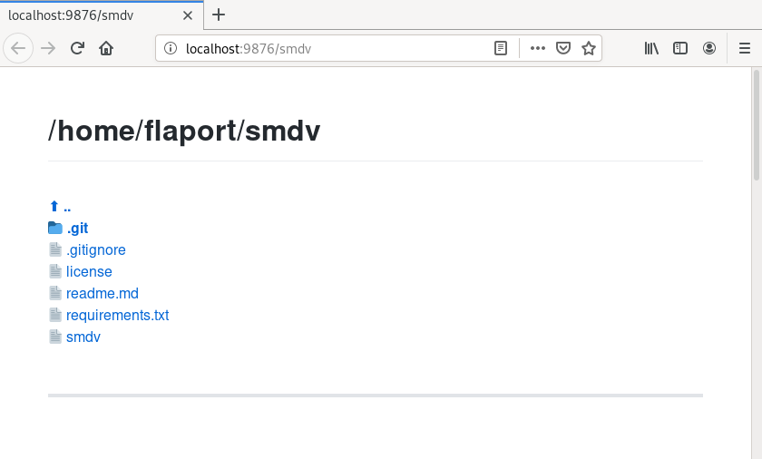

# smdv
a **s**imple **m**ark**d**own **v**iewer for linux.

## Dependencies

### Required
  - Python 3.6+ as your system `python3`.
  - [Pandoc](http://pandoc.org/) [`apt install pandoc` | `pacman -S pandoc` | ... ]
  - [Flask](http://flask.pocoo.org/) [`apt install python3-flask` | `pacman -S python-flask` | ... ]

### Optional
  - [Jupyter](http://jupyter.org) (to view jupyter notebooks) [`apt install jupyter` | `pacman -S jupyter` | ... ]
  - [Neovim Remote](https://github.com/mhinz/neovim-remote) (to sync currently open files with neovim)

## Neovim compatibility
This viewer was made with neovim compatibility in mind. With the use of `neovim-remote`,
this script is able to open files in the current neovim window (or spawn a new neovim
window if there is no window available).

However, to make it fully compatible with neovim and to make neovim able to sync the 
its current file to the viewer the following lines should be added to your `init.vim`:

```
    autocmd FileType markdown nnoremap <F5> :w<CR>:silent execute '!killall smdv; smdv %% -v "'.v:servername'" &> /dev/null & disown'<CR>
    autocmd BufWritePost *.md silent !smdv --sync %%
```

This (re)starts the viewer when pressing `<F5>` and will sync the state after every save.

## Screenshots
### markdown preview

### directory

